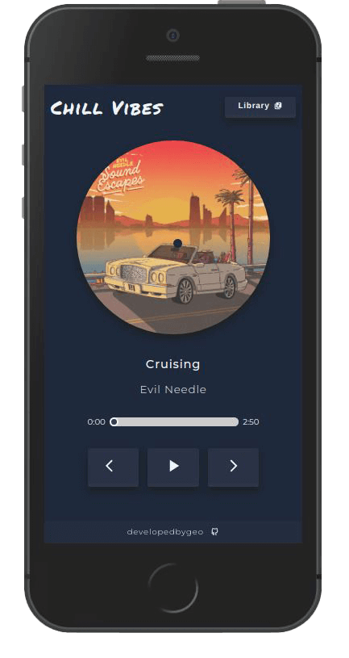
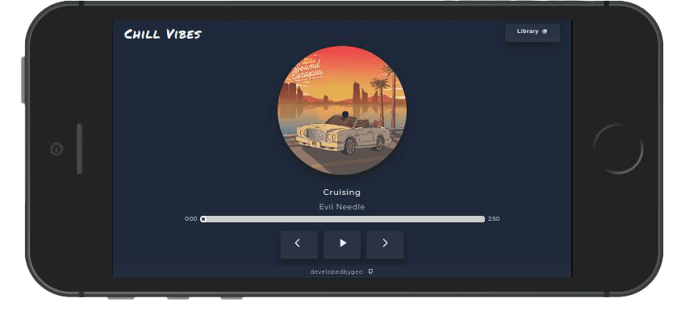

# Chill Vibes

<div style="display: flex">


</div>

<br>
<br>

A React-based, fully responsive music player that comes pre-loaded with chillhop tracks, thanks to **Chillhop.com**.

This project was a lovely chance to practise TDD (React Testing Library & Jest) with TypeScript, Redux Toolkit, Styled Components and experiment with animations. For a detailed overview, please have a look at the [**Features**](#features) & [**Tech**](#tech) section.

<br>

## Installation

As this project was bootstrapped with React, the following scripts are available:

**Install** the dependencies:

```
npm install
```

Run the app in **development** mode:

```
npm start
```

Launch the **test server** in the interactive watch mode:

```
npm test
```

## <a id='features'></a>Features

-   15 pre-loaded chillhop tracks.
-   Conditional and fluid animations.
-   Fully-responsive in both landscape & portrait mode.

## <a id='tech'></a>Tech

-   React
-   Typescript
-   Redux Toolkit
-   Styled Components
-   UUID

For a more detailed overview of the development & production dependencies, please check `package.json`.

## Live Version

<https://developedbygeo.github.io/Chill-vibes/>

## Contributing

Contributions are certainly welcome. Please feel free to open an issue/PR if there is something you would like to be changed.

## Acknowledgements

This project would not have been created if it was not for **Chillhop.com**. A massive thank you as well to The Odin Project & developedbyed for their guidance and quality material.

## License

[MIT](./LICENSE.md)
